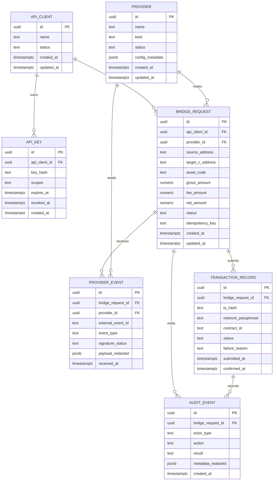

# Database Schema and Migration Strategy

The current backend is intentionally lightweight and does not ship with a required persistent database. This document records that current state and defines the recommended schema, relationships, indexes, migration process, retention policy, and operational model to use when durable storage is introduced.

## Current Persistence Model

Today, bridge operations are primarily represented by API requests, provider responses, Soroban transactions, emitted events, and logs. Durable relational storage is not required to run the current API server. This keeps local development simple, but it limits historical audit queries, support workflows, idempotency tracking, and webhook replay analysis.

When persistence is added, PostgreSQL is the recommended first database because it supports relational constraints, JSONB metadata, transactionality, indexing, and mature migration tooling.

## Proposed Entity Relationship Diagram

## Table Definitions

### api_clients

Stores an integration, team, or service account that can call authenticated API routes.

| Column | Type | Constraints | Notes |
| --- | --- | --- | --- |
| id | uuid | primary key | Generated by the database. |
| name | text | not null | Human-readable client name. |
| status | text | not null | active, suspended, or deleted. |
| created_at | timestamptz | not null | Creation timestamp. |
| updated_at | timestamptz | not null | Last metadata update. |

### api_keys

Stores hashed API key material and authorization scopes. Raw keys must never be stored.

| Column | Type | Constraints | Notes |
| --- | --- | --- | --- |
| id | uuid | primary key | Key record ID. |
| api_client_id | uuid | foreign key to api_clients.id | Owning client. |
| key_hash | text | unique, not null | Hash of the API key. |
| scopes | text[] | not null | Allowed route groups. |
| expires_at | timestamptz | nullable | Optional expiry. |
| revoked_at | timestamptz | nullable | Set when disabled. |
| created_at | timestamptz | not null | Creation timestamp. |

### providers

Represents external funding, CEX, or off-ramp providers.

| Column | Type | Constraints | Notes |
| --- | --- | --- | --- |
| id | uuid | primary key | Provider ID. |
| name | text | unique, not null | moonpay, transak, binance, coinbase, kraken, generic. |
| kind | text | not null | card_ramp, cex, off_ramp, or internal. |
| status | text | not null | active, disabled, degraded. |
| config_metadata | jsonb | nullable | Non-secret provider metadata only. |
| created_at | timestamptz | not null | Creation timestamp. |
| updated_at | timestamptz | not null | Last update. |

### bridge_requests

The canonical record for a quote, route, and funding operation.

| Column | Type | Constraints | Notes |
| --- | --- | --- | --- |
| id | uuid | primary key | Internal bridge request ID. |
| api_client_id | uuid | foreign key to api_clients.id | Request owner. |
| provider_id | uuid | foreign key to providers.id | Selected route/provider. |
| source_address | text | nullable | G-address or provider source reference. |
| target_c_address | text | not null | Destination C-address. |
| asset_code | text | not null | XLM, USDC, or configured asset. |
| gross_amount | numeric | not null | Amount before fee. |
| fee_amount | numeric | not null | Fee amount. |
| net_amount | numeric | not null | Amount delivered to target. |
| status | text | not null | quoted, pending_signature, submitted, confirmed, failed, expired. |
| idempotency_key | text | nullable | Optional client-supplied idempotency key. |
| created_at | timestamptz | not null | Creation timestamp. |
| updated_at | timestamptz | not null | Last state update. |

### provider_events

Stores webhook or provider callback events after signature verification.

| Column | Type | Constraints | Notes |
| --- | --- | --- | --- |
| id | uuid | primary key | Event record ID. |
| bridge_request_id | uuid | nullable foreign key | Linked request when known. |
| provider_id | uuid | foreign key to providers.id | Sending provider. |
| external_event_id | text | not null | Provider event ID. |
| event_type | text | not null | Provider-specific event type. |
| signature_status | text | not null | valid, invalid, missing, replayed. |
| payload_redacted | jsonb | nullable | Redacted callback payload. |
| received_at | timestamptz | not null | Receive timestamp. |

### transaction_records

Stores Soroban transaction submission and confirmation state.

| Column | Type | Constraints | Notes |
| --- | --- | --- | --- |
| id | uuid | primary key | Transaction record ID. |
| bridge_request_id | uuid | foreign key to bridge_requests.id | Owning bridge request. |
| tx_hash | text | unique | Stellar/Soroban transaction hash. |
| network_passphrase | text | not null | Testnet, mainnet, or configured network. |
| contract_id | text | not null | Bridge contract ID. |
| status | text | not null | simulated, submitted, confirmed, failed. |
| failure_reason | text | nullable | Safe diagnostic string. |
| submitted_at | timestamptz | nullable | Submission time. |
| confirmed_at | timestamptz | nullable | Confirmation time. |

### audit_events

Append-only operational and security audit trail.

| Column | Type | Constraints | Notes |
| --- | --- | --- | --- |
| id | uuid | primary key | Audit event ID. |
| bridge_request_id | uuid | nullable foreign key | Linked request when applicable. |
| actor_type | text | not null | api_client, provider, system, admin. |
| action | text | not null | quote_created, webhook_received, tx_submitted, tx_confirmed, config_changed, etc. |
| result | text | not null | success, rejected, failed. |
| metadata_redacted | jsonb | nullable | Non-secret diagnostic metadata. |
| created_at | timestamptz | not null | Event time. |

## Index and Query Strategy

Recommended indexes:

- api_keys(key_hash) unique for authentication lookup.
- bridge_requests(api_client_id, created_at desc) for client history views.
- bridge_requests(status, updated_at desc) for operational queues.
- bridge_requests(idempotency_key) unique where idempotency_key is not null.
- provider_events(provider_id, external_event_id) unique for webhook replay protection.
- transaction_records(tx_hash) unique for status lookup.
- audit_events(bridge_request_id, created_at) for support timelines.
- audit_events(action, created_at desc) for incident review.

Common query patterns:

- Find a bridge request by transaction hash.
- Find all events for a bridge request in chronological order.
- Reject duplicate webhook events by provider and external event ID.
- Show recent failed bridge requests grouped by provider.
- Reconstruct a support timeline from quote through transaction confirmation.

## Migration Management

Use timestamped, forward-only migrations committed with the code that needs them. Each migration should include:

- schema changes in a deterministic order.
- required backfill steps or explicit notes that no backfill is needed.
- rollback notes for operational recovery, even when automatic down migrations are not supported.
- migration tests or at least a local dry-run note in the PR.

Migration PRs should state whether the change is backward-compatible with the currently deployed API version. Destructive migrations require a separate rollout plan and maintainer approval.

## Query Optimization Guidelines

- Prefer narrow indexed lookups for request, provider event, and transaction hash searches.
- Keep large provider payloads redacted and in JSONB only when they are needed for diagnostics.
- Do not query unbounded audit history without a time range.
- Add EXPLAIN output to PRs that introduce new high-volume queries.
- Move analytics-style reporting to a replica or warehouse when traffic grows.

## Data Retention Policy

Suggested defaults:

- bridge_requests: retain for at least 7 years if needed for financial reconciliation, or follow the applicable compliance policy.
- provider_events: retain raw redacted payloads for 90 days, then keep normalized event metadata.
- audit_events: retain security and administrative events for at least 1 year.
- api_keys: retain revoked key hashes and metadata for incident response; never retain raw keys.
- personal data: minimize and delete or anonymize when it is no longer needed for support, legal, or reconciliation purposes.

## Backup and Recovery

- Enable automated daily backups for production.
- Test restore procedures before launch and after any database version upgrade.
- Store backups encrypted and restrict restore privileges.
- Document the recovery point objective and recovery time objective before mainnet launch.
- Keep provider secrets outside database backups unless a dedicated secret-management system requires otherwise.

## Development Seed Strategy

Seed data should be deterministic and non-secret:

- one active API client and one revoked API key hash.
- providers for moonpay, transak, binance, coinbase, kraken, and generic.
- sample bridge requests in quoted, submitted, confirmed, failed, and expired states.
- sample provider events with redacted payloads.
- sample transaction records using testnet-style transaction hashes.

Never seed real provider credentials, live API keys, private keys, seed phrases, or personal payment data.

## Read Replicas and Sharding

Read replicas are a future scaling option for dashboards, support tools, and analytics queries. Do not use replicas for read-after-write flows such as immediate bridge status checks unless the UI can tolerate replication lag.

Sharding is not recommended initially. If required later, shard by api_client_id or bridge_request creation time, and keep provider event idempotency constraints enforceable within the selected shard key.
