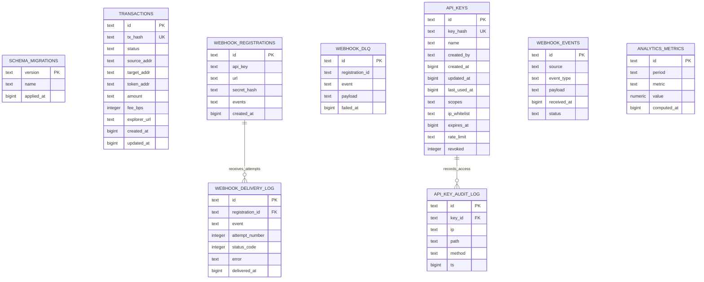

# Database Schema and Operations

This document describes the intended PostgreSQL schema, relationships, migration process, and operational strategy for the C-Address Onboarding Bridge backend.

Current state: the migrations in `api/src/migrations` document the schema and are tracked by the local migration runner. Some runtime services still use in-memory stores until full database persistence is wired in. Treat this document as the schema contract for that database integration.

## Entity Relationship Diagram



Note: `webhook_dlq.registration_id` is currently stored as text without an explicit foreign key in migration `001`. It should reference `webhook_registrations(id)` once delete behavior is settled.

## Table Definitions

### `schema_migrations`

Tracks applied database migrations.

| Column | Type | Constraints | Description |
| --- | --- | --- | --- |
| `version` | `TEXT` | Primary key | Migration version, for example `001`. |
| `name` | `TEXT` | Not null | Human-readable migration name. |
| `applied_at` | `BIGINT` | Not null | Epoch millisecond application timestamp. |

### `transactions`

Stores submitted bridge transactions and status polling state.

| Column | Type | Constraints | Description |
| --- | --- | --- | --- |
| `id` | `TEXT` | Primary key | Internal transaction ID. |
| `tx_hash` | `TEXT` | Unique, not null | Stellar/Soroban transaction hash. |
| `status` | `TEXT` | Not null, check in `pending`, `success`, `failed` | Transaction lifecycle status. |
| `source_addr` | `TEXT` | Not null | Funding source Stellar address. |
| `target_addr` | `TEXT` | Not null | Target C-address/Stellar address. |
| `token_addr` | `TEXT` | Not null | Token contract address. |
| `amount` | `TEXT` | Not null | Amount as a string to avoid precision loss. |
| `fee_bps` | `INTEGER` | Not null, default `30` | Fee charged in basis points. |
| `explorer_url` | `TEXT` | Nullable | Explorer link for successful or submitted transaction. |
| `created_at` | `BIGINT` | Not null | Epoch millisecond creation time. |
| `updated_at` | `BIGINT` | Not null | Epoch millisecond update time. |

Indexes:

| Index | Columns | Purpose |
| --- | --- | --- |
| `idx_transactions_status` | `status` | Filter status dashboards and status-specific worker scans. |
| `idx_transactions_hash` | `tx_hash` | Fast lookup by transaction hash for `/status/:txHash`. Duplicates the unique constraint but documents lookup intent. |
| `idx_transactions_source` | `source_addr` | Customer/source-address transaction history. |

### `webhook_registrations`

Stores webhook endpoints registered by API consumers.

| Column | Type | Constraints | Description |
| --- | --- | --- | --- |
| `id` | `TEXT` | Primary key | Webhook registration ID. |
| `api_key` | `TEXT` | Not null | API key or key identifier owning the registration. |
| `url` | `TEXT` | Not null | Callback URL. |
| `secret_hash` | `TEXT` | Not null | Hash of webhook signing secret. |
| `events` | `TEXT` | Not null | Serialized list of subscribed event names. |
| `created_at` | `BIGINT` | Not null | Epoch millisecond creation time. |

### `webhook_delivery_log`

Records webhook delivery attempts.

| Column | Type | Constraints | Description |
| --- | --- | --- | --- |
| `id` | `TEXT` | Primary key | Delivery attempt ID. |
| `registration_id` | `TEXT` | Not null, FK to `webhook_registrations(id)` | Destination registration. |
| `event` | `TEXT` | Not null | Event name. |
| `attempt_number` | `INTEGER` | Not null | Retry attempt number. |
| `status_code` | `INTEGER` | Nullable | HTTP response code if a response was received. |
| `error` | `TEXT` | Nullable | Delivery error text. |
| `delivered_at` | `BIGINT` | Not null | Epoch millisecond attempt timestamp. |

Relationship: one webhook registration has many delivery log rows.

### `webhook_dlq`

Stores failed webhook payloads requiring manual inspection or retry.

| Column | Type | Constraints | Description |
| --- | --- | --- | --- |
| `id` | `TEXT` | Primary key | Dead-letter entry ID. |
| `registration_id` | `TEXT` | Not null | Destination registration ID. |
| `event` | `TEXT` | Not null | Event name. |
| `payload` | `TEXT` | Not null | Serialized event payload. |
| `failed_at` | `BIGINT` | Not null | Epoch millisecond failure timestamp. |

Relationship: logically many DLQ entries belong to one webhook registration; add an FK after choosing cascade or retain-on-delete semantics.

### `api_keys`

Stores API key metadata. Raw keys are never stored.

| Column | Type | Constraints | Description |
| --- | --- | --- | --- |
| `id` | `TEXT` | Primary key | API key ID. |
| `key_hash` | `TEXT` | Unique, not null | Hash of the raw API key. |
| `name` | `TEXT` | Not null | Human-readable key name. |
| `created_by` | `TEXT` | Not null | Creator key/user ID. |
| `created_at` | `BIGINT` | Not null | Epoch millisecond creation time. |
| `updated_at` | `BIGINT` | Not null | Epoch millisecond update time. |
| `last_used_at` | `BIGINT` | Nullable | Last successful auth timestamp. |
| `scopes` | `TEXT` | Not null | Serialized scopes array. |
| `ip_whitelist` | `TEXT` | Not null, default `[]` | Serialized CIDR/IP allowlist. |
| `expires_at` | `BIGINT` | Nullable | Expiration timestamp. |
| `rate_limit` | `TEXT` | Not null, default `standard` | Rate-limit tier. |
| `revoked` | `INTEGER` | Not null, default `0` | Boolean flag, `0` active and `1` revoked. |

Indexes:

| Index | Columns | Purpose |
| --- | --- | --- |
| `idx_api_keys_hash` | `key_hash` | Authenticate incoming requests by key hash. |
| `idx_api_keys_revoked` | `revoked` | List/filter active or revoked keys. |

### `api_key_audit_log`

Records API key use for security audit and anomaly analysis.

| Column | Type | Constraints | Description |
| --- | --- | --- | --- |
| `id` | `TEXT` | Primary key | Audit event ID. |
| `key_id` | `TEXT` | Not null, FK to `api_keys(id)` | API key used. |
| `ip` | `TEXT` | Not null | Request IP address. |
| `path` | `TEXT` | Not null | Request path. |
| `method` | `TEXT` | Not null | HTTP method. |
| `ts` | `BIGINT` | Not null | Epoch millisecond timestamp. |

Indexes:

| Index | Columns | Purpose |
| --- | --- | --- |
| `idx_audit_key_id` | `key_id` | Fetch audit history for a key. |

Relationship: one API key has many audit log rows.

### `webhook_events`

Stores inbound provider webhook events for processing and analytics.

| Column | Type | Constraints | Description |
| --- | --- | --- | --- |
| `id` | `TEXT` | Primary key | Event ID. |
| `source` | `TEXT` | Not null | Provider source, for example `moonpay` or `transak`. |
| `event_type` | `TEXT` | Not null | Provider event type. |
| `payload` | `TEXT` | Not null | Serialized webhook payload. |
| `received_at` | `BIGINT` | Not null | Epoch millisecond receipt timestamp. |
| `status` | `TEXT` | Not null, default `pending`, check in `pending`, `processed`, `failed` | Processing status. |

Indexes:

| Index | Columns | Purpose |
| --- | --- | --- |
| `idx_webhook_events_source` | `source` | Provider-specific inspection and replay. |
| `idx_webhook_events_status` | `status` | Worker scans for pending/failed events. |

### `analytics_metrics`

Stores precomputed operational metrics.

| Column | Type | Constraints | Description |
| --- | --- | --- | --- |
| `id` | `TEXT` | Primary key | Metric record ID. |
| `period` | `TEXT` | Not null | Aggregation period, for example `2026-06-29T15:00Z` or `2026-06-29`. |
| `metric` | `TEXT` | Not null | Metric key. |
| `value` | `NUMERIC` | Not null | Numeric metric value. |
| `computed_at` | `BIGINT` | Not null | Epoch millisecond computation timestamp. |

Indexes:

| Index | Columns | Purpose |
| --- | --- | --- |
| `idx_analytics_period_metric` | `period`, `metric` | Fetch a named metric over a period. |

## Relationships

- `webhook_registrations` to `webhook_delivery_log`: one-to-many through `webhook_delivery_log.registration_id`.
- `api_keys` to `api_key_audit_log`: one-to-many through `api_key_audit_log.key_id`.
- `webhook_registrations` to `webhook_dlq`: logical one-to-many through `webhook_dlq.registration_id`; add an explicit foreign key before production persistence.
- `transactions` currently has no foreign keys. Addresses and token contract IDs are external Stellar/Soroban identifiers.
- `webhook_events` and `analytics_metrics` are standalone append/aggregate tables.

## Index Strategy and Query Patterns

Primary query patterns from current routes and services:

| Query pattern | Current route/service | Supporting index | Notes |
| --- | --- | --- | --- |
| Lookup transaction by hash | `/api/v1/status/:txHash`, `/api/v2/status/:txHash` | `transactions(tx_hash)` | Should be unique and used for status polling. |
| List transactions by status/date/amount | `/api/v1/transactions` | `transactions(status)` today | Add `(status, created_at DESC)` when persistence backs this route. |
| Cursor pagination by newest transaction | `listTransactions()` | Future `transactions(created_at DESC, id)` | Prefer cursor pagination over offset at scale. |
| Worker scans pending transactions | background status polling | `transactions(status)` | Add partial index `WHERE status = 'pending'` if pending rows are a small subset. |
| API key authentication | RBAC middleware | `api_keys(key_hash)` | Store and compare key hashes only. |
| Audit log by key | API key admin/audit views | `api_key_audit_log(key_id)` | Add `(key_id, ts DESC)` for time-ordered audit views. |
| Webhook delivery history by registration | webhook admin routes | FK column currently unindexed | Add `webhook_delivery_log(registration_id, delivered_at DESC)`. |
| Webhook replay/worker queue | webhook event workers | `webhook_events(status)` | Add `(status, received_at)` for pending scans. |
| Metric lookup by period/name | admin analytics | `analytics_metrics(period, metric)` | Consider unique `(period, metric)` if each metric is written once per period. |

Recommended next indexes before production DB traffic:

```sql
CREATE INDEX IF NOT EXISTS idx_transactions_status_created_at
  ON transactions (status, created_at DESC);

CREATE INDEX IF NOT EXISTS idx_transactions_created_at_id
  ON transactions (created_at DESC, id);

CREATE INDEX IF NOT EXISTS idx_api_key_audit_key_ts
  ON api_key_audit_log (key_id, ts DESC);

CREATE INDEX IF NOT EXISTS idx_webhook_delivery_registration_ts
  ON webhook_delivery_log (registration_id, delivered_at DESC);

CREATE INDEX IF NOT EXISTS idx_webhook_events_status_received
  ON webhook_events (status, received_at);
```

Avoid adding indexes for every filter in isolation. Each write to `transactions`, webhook logs, and audit logs must update every index, so indexes should correspond to proven route or worker query patterns.

## Query Optimization Guide

- Use keyset/cursor pagination for transaction history: `WHERE created_at < $cursor ORDER BY created_at DESC LIMIT $limit`.
- Keep `amount` in an exact numeric representation. The migration currently uses `TEXT`; when Postgres persistence is wired, prefer `NUMERIC(38,0)` for stroops or keep text only if values are always parsed at the application boundary.
- Select only needed columns for list endpoints; load full payloads such as webhook `payload` only on detail/replay requests.
- Use `EXPLAIN (ANALYZE, BUFFERS)` before adding new indexes to confirm sequential scans are actually a problem.
- Keep status values constrained. Invalid status values break worker scans and dashboard counts.
- For audit and webhook logs, design queries around time windows. Unbounded admin list endpoints should require pagination.
- Track slow queries in Postgres logs once a live database is attached.

## Migration History

| Version | Name | File | Purpose |
| --- | --- | --- | --- |
| `001` | `initial_schema` | `api/src/migrations/001_initial_schema.ts` | Base migration metadata, transactions, webhook registrations, webhook delivery log, webhook DLQ. |
| `002` | `api_keys_schema` | `api/src/migrations/002_api_keys_schema.ts` | API key metadata and API key audit log. |
| `003` | `analytics_schema` | `api/src/migrations/003_analytics_schema.ts` | Inbound webhook event storage and analytics metrics. |

## Migration Management

Migration commands are exposed by the API workspace:

```bash
npm run migrate --workspace api
npm run migrate:status --workspace api
npm run migrate:rollback --workspace api
npm run migrate:seed --workspace api
```

The current `MigrationRunner` records state in `.migration-state.json` by default. Once a real database client is wired into migrations, `schema_migrations` should become the source of truth instead of the local state file.

Migration rules:

- Migrations are append-only after merge. Do not edit an applied migration; add a new one.
- Use zero-downtime patterns for production: add nullable columns first, backfill, deploy code that reads/writes both shapes, then enforce constraints in a later migration.
- Create indexes concurrently for large production tables when using PostgreSQL directly.
- Keep `down()` operations for development rollback, but treat production rollback as forward-fix unless data loss risk is fully understood.
- Run `migrate:status` before deploy and after deploy.

## Development Seeding Strategy

`api/src/migrations/seed.ts` defines `DEV_SEED` for local/test data and refuses to run when `NODE_ENV=production`.

Seed contents:

- Two development API keys.
- Two transactions: one `success`, one `pending`.
- One webhook registration.

Run with:

```bash
npm run migrate:seed --workspace api
```

When database writes are implemented, seed inserts should be idempotent using stable IDs from `DEV_SEED` and should avoid real provider credentials or production-like user data.

## Data Retention Policies

Recommended baseline retention:

| Data | Retention | Rationale |
| --- | --- | --- |
| `transactions` | 7 years or business/legal requirement | Financial/audit traceability. |
| `api_keys` | Keep active and revoked metadata for 1 year after revocation | Security investigation and access history. |
| `api_key_audit_log` | 1 year hot storage, archive up to 7 years if required | Security audit and anomaly analysis. |
| `webhook_delivery_log` | 90 days hot storage | Operational debugging. |
| `webhook_dlq` | Until resolved, then 30 days | Manual recovery and incident review. |
| `webhook_events` | 180 days hot storage; archive raw payloads earlier if payloads contain PII | Provider reconciliation. |
| `analytics_metrics` | 2 years | Trend analysis without raw event retention. |

Implementation guidance:

- Add scheduled cleanup jobs for log-like tables.
- Archive before delete when compliance requires long-term retention.
- Avoid storing secrets or raw API keys in any table.
- Review webhook payload fields for PII before increasing retention.

## Backup and Restore

Backup script: `scripts/backup-db.sh`.

Capabilities:

- Full backups with `pg_dump -Fc`.
- Incremental-style table backup for high-change tables.
- Gzip compression.
- SHA-256 checksum generation.
- Upload to S3 under `s3://$BACKUP_S3_BUCKET/database/<type>/<timestamp>/`.
- Retention cleanup based on `--retention`.
- Slack and monitoring notifications when configured.

Typical full backup:

```bash
BACKUP_S3_BUCKET=bridge-backups \
DATABASE_HOST=prod-db.internal \
DATABASE_NAME=bridge \
DATABASE_USER=postgres \
PGPASSWORD=... \
bash scripts/backup-db.sh --type full --retention 30d
```

Restore test script: `scripts/test-restore.sh`.

Expected restore flow:

1. Locate latest or specified S3 backup.
2. Download dump and checksum.
3. Drop/recreate staging or test database.
4. Restore with `pg_restore --no-owner --no-acl`.
5. Validate connectivity, key table counts, schema version, and status constraints.
6. Run application tests against restored `DATABASE_URL`.

Run restore testing regularly, not only during incidents. A backup that has not been restored is not proven.

## Read Replicas and Sharding Considerations

These are future considerations, not current requirements.

Read replicas:

- Good candidates: transaction history, analytics dashboards, audit log browsing.
- Poor candidates: status polling that must observe immediately submitted transactions unless replica lag is acceptable.
- Application config should eventually separate `DATABASE_URL` for writes from `DATABASE_READ_URL` for read-heavy endpoints.

Partitioning/sharding:

- Prefer PostgreSQL partitioning before application-level sharding.
- Candidate partition keys: time-based partitions for `api_key_audit_log`, `webhook_delivery_log`, `webhook_events`, and possibly `transactions`.
- Hash sharding by tenant/API key only if traffic becomes tenant-isolated and single-table partitioning is insufficient.
- Keep transaction hash globally unique regardless of partitioning strategy.

## Open Gaps Before Production Persistence

- Wire migrations to a real `pg` client and persist migration state in `schema_migrations`.
- Add explicit foreign key for `webhook_dlq.registration_id` or document why DLQ rows must survive registration deletion.
- Align backup incremental table list with actual schema; the script currently references `idempotency_keys`, which is not present in current migrations.
- Convert serialized JSON `TEXT` fields to `JSONB` where queryability is needed, especially `api_keys.scopes`, `api_keys.ip_whitelist`, webhook events, and DLQ payloads.
- Decide whether `transactions.amount` remains `TEXT` or becomes exact `NUMERIC`.
