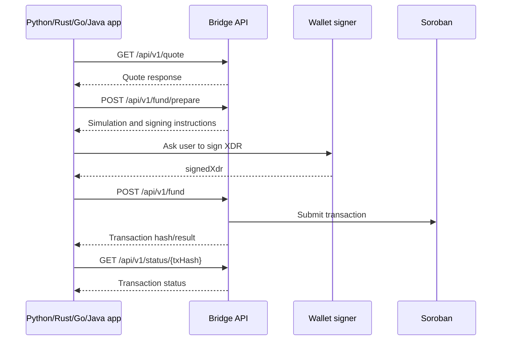

# Multilingual SDK Usage Examples

The TypeScript SDK is the primary implementation, but dApps and wallets often use other backend languages. These examples show how to integrate with the HTTP API from Python, Rust, Go, and Java while keeping the same flow: create a client, get a quote, prepare funding, submit a signed XDR, check transaction status, and create Moonpay or Transak URLs.

All examples assume these environment variables:

```bash
export C_ADDRESS_API_URL=http://localhost:3000
export C_ADDRESS_API_KEY=replace-me
export SOURCE_ASSET=native
export AMOUNT_STROOPS=10000000
export SOURCE_ADDRESS=G...
export TARGET_C_ADDRESS=C...
export TOKEN_ADDRESS=C...
export SIGNED_XDR=AAAA...
export TX_HASH=aaaaaaaaaaaaaaaaaaaaaaaaaaaaaaaaaaaaaaaaaaaaaaaaaaaaaaaaaaaaaaaa
```

The examples intentionally use direct HTTP calls. If language-specific SDKs are added later, they should preserve these request and response semantics.

## API Flow



## Python

Install dependencies:

```bash
python -m venv .venv
. .venv/bin/activate
pip install requests
```

Example:

```python
import os
import requests

BASE_URL = os.environ.get('C_ADDRESS_API_URL', 'http://localhost:3000')
API_KEY = os.environ['C_ADDRESS_API_KEY']
HEADERS = {'Authorization': f'ApiKey {API_KEY}', 'Content-Type': 'application/json'}

def get_quote():
    response = requests.get(
        f'{BASE_URL}/api/v1/quote',
        headers=HEADERS,
        params={
            'sourceAsset': os.environ.get('SOURCE_ASSET', 'native'),
            'amount': os.environ['AMOUNT_STROOPS'],
            'targetAddress': os.environ['TARGET_C_ADDRESS'],
        },
        timeout=15,
    )
    response.raise_for_status()
    return response.json()

def prepare_funding():
    payload = {
        'sourceAddress': os.environ['SOURCE_ADDRESS'],
        'targetAddress': os.environ['TARGET_C_ADDRESS'],
        'tokenAddress': os.environ['TOKEN_ADDRESS'],
        'amount': os.environ['AMOUNT_STROOPS'],
        'memo': 'python-example',
    }
    response = requests.post(f'{BASE_URL}/api/v1/fund/prepare', headers=HEADERS, json=payload, timeout=20)
    response.raise_for_status()
    return response.json()

def submit_signed_xdr():
    response = requests.post(
        f'{BASE_URL}/api/v1/fund',
        headers=HEADERS,
        json={'signedXdr': os.environ['SIGNED_XDR']},
        timeout=30,
    )
    response.raise_for_status()
    return response.json()

def get_status(tx_hash):
    response = requests.get(f'{BASE_URL}/api/v1/status/{tx_hash}', headers=HEADERS, timeout=15)
    response.raise_for_status()
    return response.json()

def create_moonpay_url():
    response = requests.post(
        f'{BASE_URL}/api/v1/offramp/moonpay',
        headers=HEADERS,
        json={'currencyCode': 'xlm', 'walletAddress': os.environ['TARGET_C_ADDRESS'], 'walletNetwork': 'stellar'},
        timeout=15,
    )
    response.raise_for_status()
    return response.json()['url']

try:
    print('quote', get_quote())
    print('prepare', prepare_funding())
    print('moonpay', create_moonpay_url())
except requests.HTTPError as exc:
    print('Bridge API error:', exc.response.status_code, exc.response.text)
```

## Rust

Cargo dependencies:

```toml
[dependencies]
anyhow = "1"
reqwest = { version = "0.12", features = ["json"] }
serde = { version = "1", features = ["derive"] }
serde_json = "1"
tokio = { version = "1", features = ["macros", "rt-multi-thread"] }
```

Example:

```rust
use anyhow::Result;
use reqwest::Client;
use serde_json::json;
use std::env;

fn env_or(key: &str, default: &str) -> String {
    env::var(key).unwrap_or_else(|_| default.to_string())
}

#[tokio::main]
async fn main() -> Result<()> {
    let base_url = env_or("C_ADDRESS_API_URL", "http://localhost:3000");
    let api_key = env::var("C_ADDRESS_API_KEY")?;
    let client = Client::new();

    let quote = client
        .get(format!("{}/api/v1/quote", base_url))
        .header("Authorization", format!("ApiKey {}", api_key))
        .query(&[
            ("sourceAsset", env_or("SOURCE_ASSET", "native")),
            ("amount", env::var("AMOUNT_STROOPS")?),
            ("targetAddress", env::var("TARGET_C_ADDRESS")?),
        ])
        .send()
        .await?
        .error_for_status()?
        .json::<serde_json::Value>()
        .await?;
    println!("quote: {quote}");

    let prepare = client
        .post(format!("{}/api/v1/fund/prepare", base_url))
        .header("Authorization", format!("ApiKey {}", api_key))
        .json(&json!({
            "sourceAddress": env::var("SOURCE_ADDRESS")?,
            "targetAddress": env::var("TARGET_C_ADDRESS")?,
            "tokenAddress": env::var("TOKEN_ADDRESS")?,
            "amount": env::var("AMOUNT_STROOPS")?,
            "memo": "rust-example"
        }))
        .send()
        .await?
        .error_for_status()?
        .json::<serde_json::Value>()
        .await?;
    println!("prepare: {prepare}");

    Ok(())
}
```

## Go

Initialize the module:

```bash
go mod init example.com/c-address-bridge-client
```

Example:

```go
package main

import (
    "bytes"
    "encoding/json"
    "fmt"
    "net/http"
    "net/url"
    "os"
    "time"
)

func getenv(key, fallback string) string {
    if value := os.Getenv(key); value != "" { return value }
    return fallback
}

func request(method, path string, body any) (*http.Response, error) {
    baseURL := getenv("C_ADDRESS_API_URL", "http://localhost:3000")
    var payload *bytes.Reader
    if body != nil { data, _ := json.Marshal(body); payload = bytes.NewReader(data) } else { payload = bytes.NewReader(nil) }
    req, err := http.NewRequest(method, baseURL+path, payload)
    if err != nil { return nil, err }
    req.Header.Set("Authorization", "ApiKey "+os.Getenv("C_ADDRESS_API_KEY"))
    req.Header.Set("Content-Type", "application/json")
    return (&http.Client{Timeout: 20 * time.Second}).Do(req)
}

func main() {
    query := url.Values{}
    query.Set("sourceAsset", getenv("SOURCE_ASSET", "native"))
    query.Set("amount", os.Getenv("AMOUNT_STROOPS"))
    query.Set("targetAddress", os.Getenv("TARGET_C_ADDRESS"))
    quoteResp, err := request("GET", "/api/v1/quote?"+query.Encode(), nil)
    if err != nil { panic(err) }
    defer quoteResp.Body.Close()
    fmt.Println("quote status", quoteResp.Status)

    prepareBody := map[string]string{
        "sourceAddress": os.Getenv("SOURCE_ADDRESS"),
        "targetAddress": os.Getenv("TARGET_C_ADDRESS"),
        "tokenAddress": os.Getenv("TOKEN_ADDRESS"),
        "amount": os.Getenv("AMOUNT_STROOPS"),
        "memo": "go-example",
    }
    prepareResp, err := request("POST", "/api/v1/fund/prepare", prepareBody)
    if err != nil { panic(err) }
    defer prepareResp.Body.Close()
    fmt.Println("prepare status", prepareResp.Status)
}
```

## Java

Maven dependency for JSON handling:

```xml
<dependency>
  <groupId>com.fasterxml.jackson.core</groupId>
  <artifactId>jackson-databind</artifactId>
  <version>2.17.2</version>
</dependency>
```

Example using Java 11 HttpClient:

```java
import com.fasterxml.jackson.databind.ObjectMapper;
import java.net.URI;
import java.net.URLEncoder;
import java.net.http.HttpClient;
import java.net.http.HttpRequest;
import java.net.http.HttpResponse;
import java.nio.charset.StandardCharsets;
import java.util.Map;

public class BridgeExample {
  static final ObjectMapper JSON = new ObjectMapper();
  static final HttpClient HTTP = HttpClient.newHttpClient();

  static String env(String key, String fallback) {
    String value = System.getenv(key);
    return value == null || value.isBlank() ? fallback : value;
  }

  static HttpRequest.Builder request(String path) {
    return HttpRequest.newBuilder(URI.create(env("C_ADDRESS_API_URL", "http://localhost:3000") + path))
      .header("Authorization", "ApiKey " + System.getenv("C_ADDRESS_API_KEY"))
      .header("Content-Type", "application/json");
  }

  public static void main(String[] args) throws Exception {
    String target = URLEncoder.encode(System.getenv("TARGET_C_ADDRESS"), StandardCharsets.UTF_8);
    String quotePath = "/api/v1/quote?sourceAsset=" + env("SOURCE_ASSET", "native") + "&amount=" + System.getenv("AMOUNT_STROOPS") + "&targetAddress=" + target;
    HttpResponse<String> quote = HTTP.send(request(quotePath).GET().build(), HttpResponse.BodyHandlers.ofString());
    System.out.println("quote status=" + quote.statusCode() + " body=" + quote.body());

    Map<String, String> body = Map.of(
      "sourceAddress", System.getenv("SOURCE_ADDRESS"),
      "targetAddress", System.getenv("TARGET_C_ADDRESS"),
      "tokenAddress", System.getenv("TOKEN_ADDRESS"),
      "amount", System.getenv("AMOUNT_STROOPS"),
      "memo", "java-example"
    );
    HttpResponse<String> prepare = HTTP.send(
      request("/api/v1/fund/prepare").POST(HttpRequest.BodyPublishers.ofString(JSON.writeValueAsString(body))).build(),
      HttpResponse.BodyHandlers.ofString()
    );
    System.out.println("prepare status=" + prepare.statusCode() + " body=" + prepare.body());
  }
}
```

## Dockerized Example Runner

A lightweight runner can mount any example directory and run the language-specific command:

```dockerfile
FROM debian:bookworm-slim
WORKDIR /examples
RUN apt-get update && apt-get install -y --no-install-recommends python3 python3-pip curl ca-certificates && rm -rf /var/lib/apt/lists/*
CMD ["python3", "python/example.py"]
```

For production-quality examples, create one Dockerfile per language so CI can compile or run each example independently.

## CI Checks

Suggested CI checks for future language-specific example directories:

```yaml
name: example-smoke-tests
on: [pull_request]
jobs:
  examples:
    runs-on: ubuntu-latest
    steps:
      - uses: actions/checkout@v4
      - uses: actions/setup-python@v5
        with: { python-version: '3.12' }
      - uses: actions/setup-go@v5
        with: { go-version: '1.22' }
      - uses: actions/setup-java@v4
        with: { distribution: 'temurin', java-version: '21' }
      - uses: dtolnay/rust-toolchain@stable
      - run: python -m py_compile examples/python/example.py
      - run: cargo check --manifest-path examples/rust/Cargo.toml
      - run: go test ./examples/go/...
      - run: mvn -f examples/java/pom.xml test
```

## Error Handling Checklist

Each language wrapper should:

- Treat 400 and 422 responses as validation failures that should be shown to developers or users with actionable field details.
- Treat 401 and 403 responses as credential or scope problems.
- Retry 429, 502, 503, and 504 responses with bounded exponential backoff when the operation is idempotent.
- Never retry signed transaction submission blindly unless the caller supplies an idempotency key or first checks transaction status.
- Log correlation IDs and transaction hashes, but never log API keys, private keys, seed phrases, or full payment-provider personal data.
